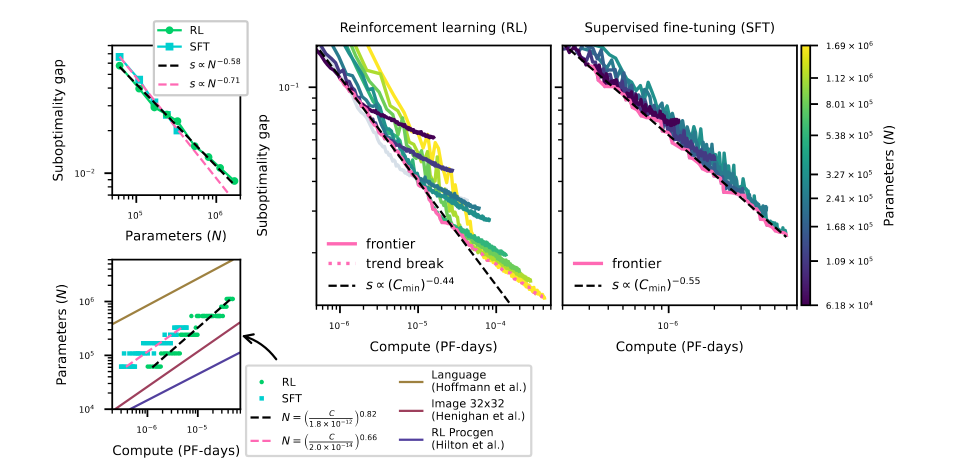
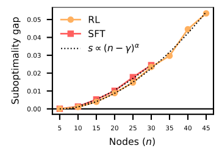

It makes total sense and I wonder why no one has thought about this study before. My own PhD thesis
is about studying the generalization of neural solvers over problem complexity, and yet I never
thought about any *neural scaling law over problem complexity*.

That being said, it's a bummer that they did not explore *problem-size generalization*. They only
trained and evaluated models at a fixed complexity. I guess it's easier to transfer such results to
another field.

## Results

Their main goal is to predict the model's *suboptimality gap* w.r.t. both the compute and the number
of parameters of a model. Their main results are shown in the figure below:

The suboptimality gap is expressed as the average gap between the neural solver's solution and the
one produced by Concorde. They find similar curves to the ones we're used to seeing for GPT models.
Nothing surprising: the bigger the model, the better, the longer you train, the better. But it's
great to see some validation and to know it follows the classical scaling law.

They show this trend for both SFT and RL training. It looks like RL scales better with compute, but
it might be due to their specific training choices, not because of some underlying property of RL
training.

Another important result is the plot of their suboptimality gap w.r.t. the number of cities in the
TSP. They fixed the number of parameters of their neural solver and trained different sizes of TSPs
to evaluate their performance on those sizes. It shows that the model follows a superlinear power
growth:

That is:

$$
s \propto (n - \gamma)^{\alpha}
$$

with $\gamma$ and $\alpha$ being parameters to fit experimentally.

A particular choice of model and training design will yield different values for $\alpha$ (the
lower, the better). But this paper suggests that it will always follow this superlinear power growth
trend.

## Comments

I wonder why they did not evaluate the optimality gap instead of the suboptimality gap. It's pretty
easy to compute the optimality of a small set of TSPs and talk about the optimality gap for the
whole paper. We can assume it would have raised the same results, but it would have made a stronger
case.

Also, I wonder how everything changes if we look at the optimality gap in percentage, as we usually
do in NCO.

They used a lot of compute. Their most expensive training used the equivalent of 24 days of V100 (RL
training over TSP-50).

It's sad they only evaluated TSPs of sizes ranging from 5 to 50. It's uncertain whether any results
they obtained will hold for problems with over 100 cities.

I wonder why they also studied the scaling laws over the number of dimensions of the cities.

RL's trend breaks after some scale. I wonder if it might be because the training is unstable at 6M
parameters using PPO.

Being parameter-dependent means that we should take care to keep roughly the same number of
parameters when comparing two approaches in NCO.

It's possible that BQ-NCO performs so well because it focuses its entire computation on predicting
the next city to visit. Nothing from previous predictions can be reused.

I wonder why they get so little compute with their SFT. SFT is the most common way of training
neural TSP solvers. They say that it is because of the low number of training samples. They have 12M
training data for TSP-20! This is more than enough!

They point out that their neural scaling law is probably not holding at higher problem complexity
because it would mean that the model is doing worse than a random heuristic after some problem-size
(random solver has a linear scaling law). This shows that after some complexity, a new law is
necessary, probably the same as the random solver scaling law. Also, they point out that if we
extrapolate RL's scaling law, it would only happen at around TSP-40k, which is huge.

They fixed the training choices for RL and SFT and found out it was probably suboptimal for some
training runs (learning rate decay may have been too strong for some training runs). They ignored
those failed runs, which is probably the best thing to do.

**The saddest part of this paper is that they did not evaluate the model's generalization capability :(**

[paper]: https://arxiv.org/abs/2506.12932
