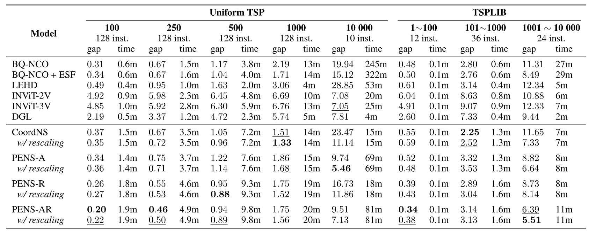
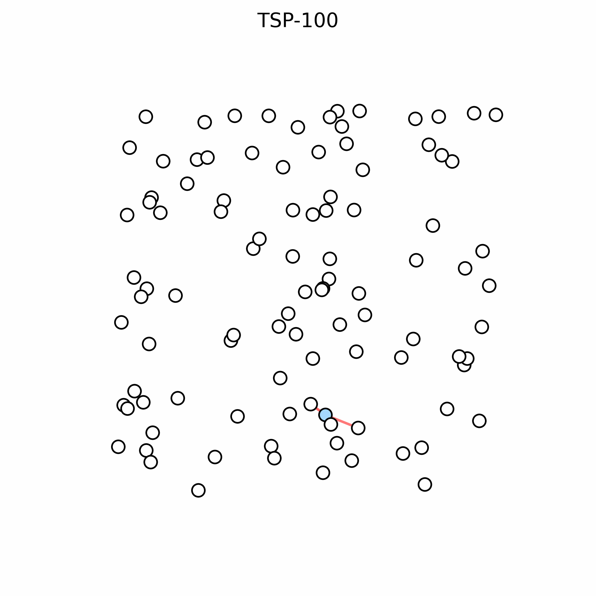
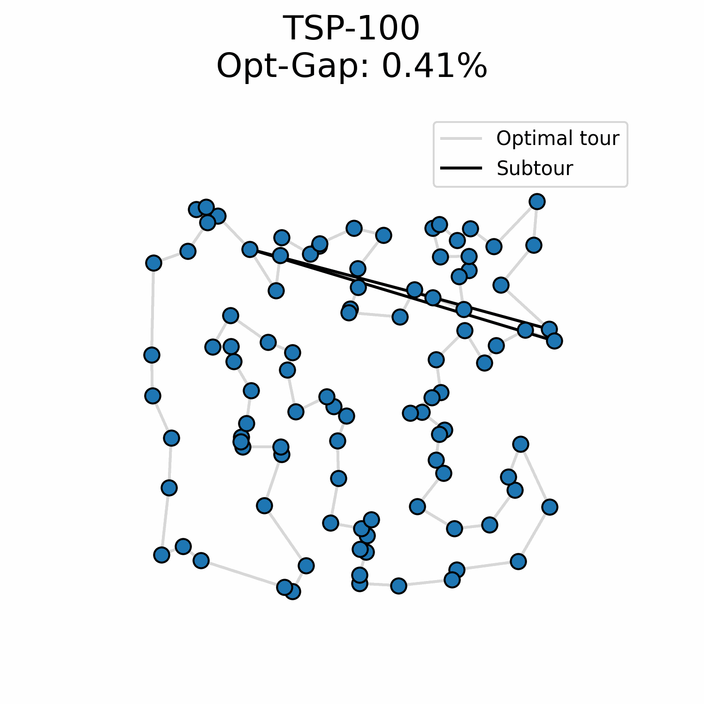

# PhD: Year 2
All french PhD students have to do an annual report and discuss with a committee to evaluate if the
PhD is going appropriately. This summary is a good exercise and I figured out I could share it here
as well.

My PhD is in **Neural Combinatorial Optimization**, I train neural networks to solve combinatorial
optimization problems. In particular, I study and improve the ability of neural solvers to
generalize to large-scale combinatorial problems. My research has mainly been focused on the
Traveling Salesman Problem (TSP).

## June to September: PENS
At the end of last year, I had early results on the use of ALiBi's Positional Encoding. It was
originally developed to extend **LLM's sequence-length generalization**, and applying it to the TSP
showed promising problem-size generalization results. Having made that link with PEs, I also
experimented with RoPE and gathered some very good results. This work led to a (yet unpublished)
paper:

1. We draw an explicit link between NLP's sequence-length generalization and NCO's problem-size
   generalization.
2. We evaluate how good ALiBi and RoPE are at providing TSP's distances to our neural solvers. RoPE
   gives rich features while ALiBi makes our solver more robust on large instances.
3. We use a rescaling heuristic which makes cities easier to distinguish for the model at large
   scale.

Ultimately, we showed state-of-the-art results on instances with up to 10 000 cities. We show that
graph sparsification is not a necessity at large scale, something that is not the trend in the
current NCO landscape. Our approach is conceptually simpler and our modifications are principled
towards the issues that transformers face when generalizing to large instances.

Work from [@Fang2024] introduced the issue of embedding aliasing, which occurs when city coordinates
become densely distributed. We showed experimentally that stretching the input space by some scaling
factor can help. On TSP-10 000, this reduces the optimal gap by two!

**The main criticism of our work is that our rescaling heuristic is what it is, a heuristic.** While
this heuristic is a direct answer to the embedding aliasing issue, it still needs to be calibrated
for each instance size to be properly applied. I agree it is not a definitive solution, but it
demonstrates that a pure transformer can compete with sparsification-based solvers when scaling
issues are properly tackled.

**(Latest results)** I recently experimented with a version where the model predicts the scaling
factor itself (similarly to [@Veisi2025]). The model learns how to use this factor during training,
and early results are very good. The new solver generates solutions that are even slightly better
than our best solver on TSP-10 000 that uses the heuristic ($5.30\%$ vs $5.46\%$).

## From October to March: encoding the TSP solution onto a circle
After our work with PENS, we wanted to explore approaches that iteratively refine the solution. PENS
builds the solution step-by-step by predicting the next city to add to the path, until all cities
are visited:

We argue that this is not particularly natural for the TSP since there's not really a starting or
ending point, **the solution is a cycle**. PENS' performance is actually impacted by the sampling of
the starting city. Moreover, the computation effort is directly tied to the size of the instance, it
is not possible to generate a solution with less than $O(N)$ forward steps.

To decouple instance size from computing effort, we needed a way to encode the solution as a whole.
Most work such as DIFUSCO ([@Sun2023]) uses a graph where each edge predicts its probability of being
in the optimal path. This does not directly produce a solution and it typically requires the
additional use of MCTS to decode a good solution out of the probabilities. Instead, we aimed for a
way to directly output the solution without any ambiguity and decided to represent the cycle by
placing each city on a circle. The solution is obtained by following the order of the cities on the
circle:

We turned the discrete generation problem into a continuous one where the goal is to predict the
right angle value for each city. This formulation makes it easy to use flow matching, and we showed
that we could trade compute for solution quality.

**Sadly, our results are not competitive!** My best explanation is that unlike discrete models that
can output a multimodal probability distribution over cities, our model must predict a single scalar
value. If our model is uncertain between two valid angles, the MSE loss encourages it to predict the
mean, which would result in a degenerate solution. Similar results are already known in image
understanding ([Welch Labs: Yann LeCun's $1B Bet Against LLMs](https://youtu.be/kYkIdXwW2AE?si=OSw9RHWKpVmY8vwI&t=899)).

We did not write any paper about it because the results are not good enough, but I wrote a small
post [here](/posts/circular-tsp/).

## Short-term goals
Our latest results with the model stretching the input space itself will be further investigated. I
also want to find a better way to solve the TSP than the autoregressive approach. The idea of
generating the solution with flow matching is interesting and maybe I should try it in some latent
space instead.

Everything I tried up until now has been worse. A recent idea I tried has been an insertion
approach:

At every step, the model predicts where each unvisited node should be added in the subtour. This
might make sense because the model is not forced into a specific order of solution generation.
Instead, I insert the node for which the model is the most certain of its position in the subtour.
Early results are better than my flow matching experiment but not competitive regarding the
problem-size generalization.

## Long-term goal
I want to finish the PhD with some test-time compute approach. I don't know yet exactly how I should
do it, but I like the ideas from Deep Equilibrium Models, Recursive Neural Networks, and
Energy-based Models. Either one of the three could be fun and could work well. I still need to find
a good way to generate the solution as a whole if I want to apply those models.

## Importance of research
Problem-size generalization is of utmost importance for the applicability of NCO in the industry. I
do not see TSP as a target but a playground in which I can explore NCO ideas and better understand
what works and what doesn't. It also serves as a deep learning benchmark in general: I can take
ideas from text and image generation and judge their efficiency at generating TSP solutions.
Hopefully, new ideas and understanding coming from NCO will also help other deep learning domains as
well.

In the end, I also like the idea of building a principled neural solver. TSP has many invariances
and I want my solver to reflect those realities, all while being robust to large-scale phenomena.
Outside of those hardcoded constraints, I try to rely on the training algorithm as much as possible.
I believe that approach is how NCO should be used.
