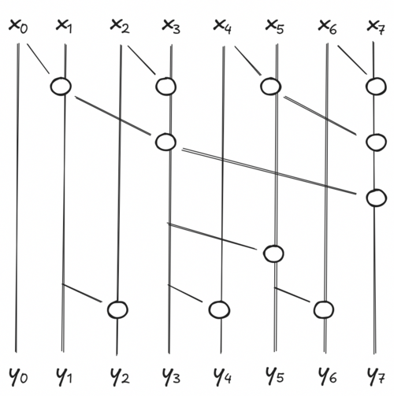
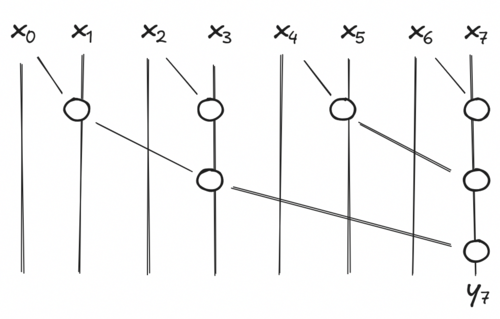

> _... the all-prefix-sum operation is a good example of a computation that seems inherently
> sequential, but for which there is an efficient parallel algorithm._
>
> _Prefix Sums and Their Applications, [Guy E. Blelloch 1993][blelloch93]_

Recently, I was wondering if it was possible to compute the discounted sum of rewards used in RL
using an associative scan _- it turns out, it is!_. It led me to dig a little bit what there is
behind this operation.

## So What is the Associative Scan?

Let's say you want to compute the cumulative sum of an array of elements $x_1, x_2, ..., x_N$, such
that $y_i = \sum_{j = 1}^i x_i$. A straightforward approach would loop over the elements and compute
$y_i = y_{i - 1} + x_i$. More generally, it is very common to apply a function $f$ such that $y_i =
f(y_{i - 1}, x_i)$.

The _associative scan_ (also known as _parallel scan_ or _prefix sum_) is an efficient way to
compute all $y_i$ when the function $f$ is associative, i.e. $f(f(a, b), c) = f(a, f(b, c))$.

Thanks to associativity, we can move the function $f$ around:

$$
f(f(f(a, b), c), d) = f(f(a, b), f(c, d))
$$

The left side is the sequential execution of the scan, running in $O(N)$. The right side runs in
$O(log N)$ because the inner calls can be applied in parallel. The parallel execution is usually
visualized with the following [circuit][prefix-sum-wikipedia]:



Each circle is an execution of $f$, and each stage is executed simultaneously. If you look at any
$y_i$ and climb up, you will see that every element before $x_j$ are reachable, meaning they took
part of the final computation of $y_i$. [Multiple other combinations are possible][nvidia-course],
but this is one of the most work-efficient. It has a good trade-off between parallelization and
computation.

## Practical Implementation

At first glance, the image is not easy to reproduce for any vector size. Thankfully, looking at the
way [JAX implemented][jax-code] it is enough.

Maybe first we can start with a way to compute the sum of an array recursively:

```python
def associative_reduce(fn: Callable[[Array, Array], Array], elems: Array) -> Array:
    if len(elems) < 2:
        return elems

    result = fn(elems[::2], elems[1::2])
    return associative_reduce(fn, result)

elems = jnp.arrange(8)
print(associative_reduce(lambda a, b: a + b, elems))  # [28]
print(jnp.sum(elems))                                 # 28
```

At every iterations, we separate the array into elements at even and odd indices. We then apply the
function `fn` in parallel to all pairs `(even, odd)` elements. The result contains all partial sums
of our pairs. We can simply call our function again to compute in parallel the rest of the sum.
While this particular implementation is not very efficient for computing the whole sum (everything
could be done in parallel), you can see how time complexity is reduced from $O(N)$ to $O(log N)$.
Also, for simplification we only handle cases where the input is a power of 2.



The associative scan is very similar, but we keep intermediate results and compute missing ones.
Let's say at some point of our recursion we have $4$ elements $(x_0, x_1, x_2, x_3)$ in our array.
If we can compute the exact value of our odds elements $y_1$ and $y_3$, it is easy to deduce the
value of our remaining even elements $y_0$ and $y_2$. $y_0$ is easy, it is by definition $x_0$.
$y_2$ is defined recursively by $y_2 = f(y_1, x_2)$.

The last call of our associative scan will compute the last odd element $y_{N - 1}$ and we compute
the missing even results of all intermediate calls in order to return the exact value of our elems
at every step of our recursion. In general, we compute $y_i = f(y_{i - 1}, x_i)$ for all $i$ even
and that is non-zero.

```python
def associative_scan(fn: Callable[[Array, Array], Array], elems: Array) -> Array:
    if len(elems) < 2:
        return elems

    reduced_elems = fn(elems[::2], elems[1::2])
    odd_elems = associative_scan(fn, reduced_elems)
    even_elems = fn(odd_elems[:-1], elems[2::2])
    even_elems = jnp.concat((elems[:1], even_elems))
    return _interleave(even_elems, odd_elems, axis=0)

elems = jnp.arange(8)
print(associative_scan(lambda a, b: a + b), elems)  # [ 0  1  3  6 10 15 21 28]
print(jnp.cumsum(elems))                            # [ 0  1  3  6 10 15 21 28]
```

Looking at the original figure and this code should make sense, I hope.

Again, this code will only work for arrays that are a power of 2. The JAX implementation handles
inputs of any sizes and even pytrees. Also, I am cheating a little bit because the `_interleave`
operation does not exist in the public JAX API, I stole it from
[`jax._src.lax.control_flow.loops`][jax-interleave].

## Discounted Sum of Rewards

In the beginning I said that I wanted to compute the discounted sum of rewards using an associative
scan. As a reminder, the discounted sum of rewards is computed as:

$$
y_i = \sum_{j = i}^N \gamma^{j - i} r_j = r_i + \gamma * y_{i + 1}
$$

Here is the code I went with:

```python
def discounted_returns(rewards: Array, gamma: float) -> Array:
    """Compute the discounted sum of rewards using an associative scan.

    ---
    Args:
        rewards: Rewards of a single rollout.
        gamma: Discount factor.

    ---
    Returns:
        The discounted sum of rewards.
    """

    def associative_fn(a: tuple[Array, Array], b: tuple[Array, Array]) -> tuple[Array, Array]:
        """`a` and `b` are tuples of (partial result, list index)."""
        value_a, index_a = a
        value_b, index_b = b
        power = index_a - index_b
        return value_b + gamma**power * value_a, index_b

    returns, _ = jax.lax.associative_scan(
        associative_fn,
        (rewards, jnp.arange(len(rewards))),
        reverse=True,
        axis=0,
    )
    return returns
```

You can easily show that this function is indeed associative. And well, it is not as if it was a
costly computation to begin with, but I was frustrated to iterate item by item because I felt like
there must be a better way. I am now satisfied. For an array with 65 536 elements, it takes 400ms
for the sequential scan against about 0.1ms for the associative scan.

Associative scan is the main trick allowing state space models to run in $O(N)$ time and $O(1)$ in
memory at inference (sequential execution) and yet run in $O(log N)$ time and $O(N)$ memory during
training (associative execution). While I'm not sure SSMs are the future, _and I honestly know very
little about this architecture_, it's still useful to know exactly what is hidden behind such
operation. The idea is neat and easy to exploit.

_Many thanks to [Taha](https://github.com/taha-yassine) and [Adel](https://github.com/Adel-Moumen)
for their helpful review._

[blelloch93]:           https://www.cs.cmu.edu/~guyb/papers/Ble93.pdf
[jax-code]:             https://github.com/jax-ml/jax/blob/93f9e6fa9ca4e27442b9721f7c2224429ec6d10f/jax/_src/lax/control_flow/loops.py#L2579-L2720
[jax-doc]:              https://docs.jax.dev/en/latest/_autosummary/jax.lax.associative_scan.html
[jax-interleave]:       https://github.com/jax-ml/jax/blob/93f9e6fa9ca4e27442b9721f7c2224429ec6d10f/jax/_src/lax/control_flow/loops.py#L2721
[nvidia-course]:        https://developer.nvidia.com/gpugems/gpugems3/part-vi-gpu-computing/chapter-39-parallel-prefix-sum-scan-cuda
[prefix-sum-wikipedia]: https://en.wikipedia.org/wiki/Prefix_sum#Algorithm_2:_Work-efficient
