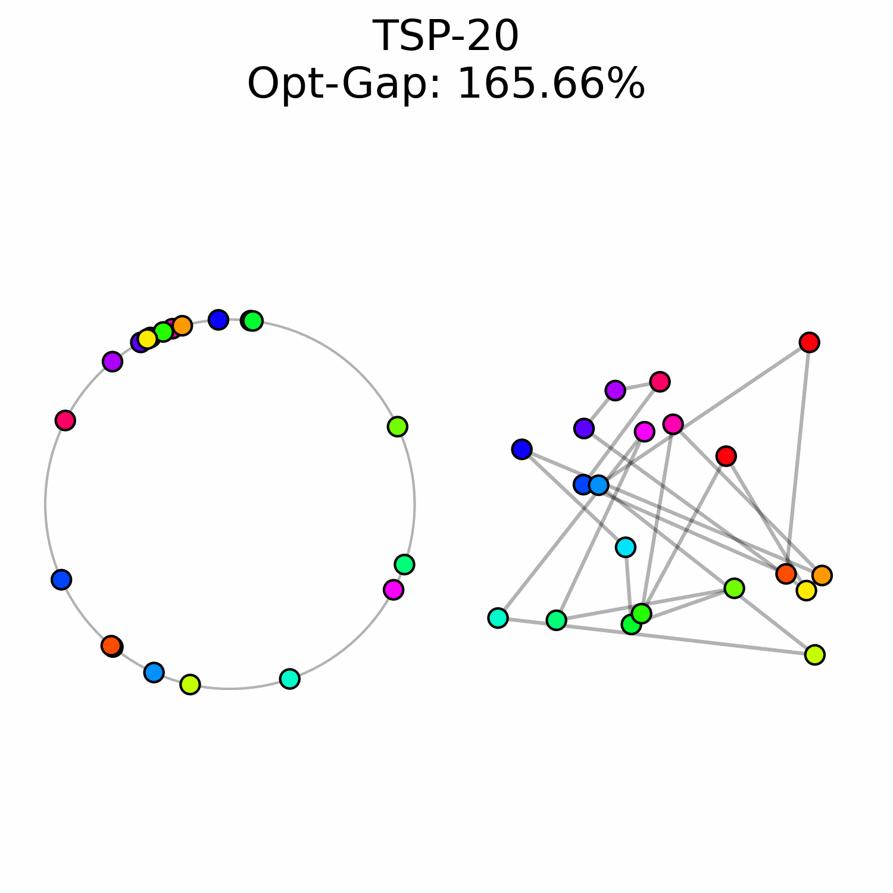
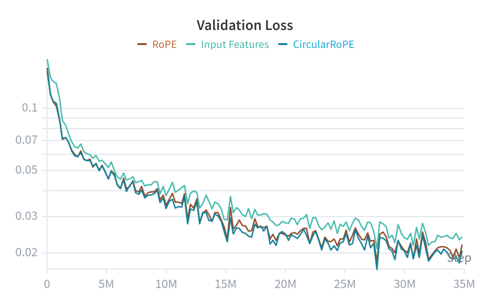

Neural Combinatorial Optimization (NCO) aims to simplify the design of combinatorial optimization
solvers by leveraging neural networks. It's an exciting area of research because learning-driven
heuristics have the potential to outperform manually designed ones. In this post, we focus on the
Traveling Salesman Problem (TSP), one of the most famous NCO problem, and propose to **encode the
solution onto a circle**. Our motivation is to provide a flexible and straightforward way to
represent the solution. As example, we use **flow matching** to generate the solutions by "sliding"
the points on the circle. We also introduce **CircularRoPE**, a simple modification to Rotary
Positional Embedding that ensures our neural solver remains invariant to circle's rotation. While
our results are not on par with the state-of-the-art, we hope this post will motivate future similar
research directions.

## Motivation
Most NCO solvers fall into two categories: autoregressive and heatmap-based solvers.

**About autoregressive solvers.** State-of-the-art solvers like BQ-NCO or INViT treat the TSP
solution as a sequence prediction. Starting from an initial city, the solver is repeatedly called to
select the next city to visit. This starting point forces the model to learn that many different
sequences represent the same optimal tour and the arbitrary choice of initial city can bias the
whole solution generation. In addition, the number of forward passes is tied to the instance size
$N$, preventing from easily trading inference time for solution quality.

**About heatmap solvers.** Heatmap-based approaches, like DIFUSCO, avoid sequential bias by
predicting an $N \times N$ edge adjacency matrix. While these methods consider the solution as a
whole, the heatmap is not a tour and they require a search algorithm (e.g. MCTS) to project the
heatmap onto the space of Hamiltonian cycles. This creates a gap between what the neural network
optimizes and what the final solver produces. Furthermore, they have to keep the search space
manageable and often restrict the search within the $k$-nearest neighbor graphs. This introduces a
manual inductive bias that may exclude the true optimal edges.

Ideally, only a strict minimum set of inductive biases are embedded within the solver and the rest
should be handled by the neural network. We argue that a solver should embed the cyclic nature of
the TSP directly into its output space. By mapping the $N$ cities onto a unit circle, we represent
the tour as a sequences of angles $(a_i)_1^N$. The tour is recovered simply by sorting the cities by
their angular position. This approach offers three distinct advantages:

1. **Direct Decoding:** Our representation is always valid. Any set of $N$ distinct angles defines a
   valid Hamiltonian cycle, removing the need for complex post-processing.
2. **Generative Flexibility:** Because the representation is continuous, we can leverage **Flow
   Matching** to treat solving as an ODE-based refinement process. We design a specific loss that
   takes into account the circular invariances of our solution representation.
3. **Variable NFEs:** By using an ODE solver, we decouple the solving effort from the number of
   cities. We can refine a solution using 10, 100 or 1000 Number of Function Evaluations (NFEs),
   allowing for a dynamic trade-off between speed and optimality gap.

## Solution Representation
A TSP instance is defined by a set of $N$ cities with coordinates $X = \{x_i\}_1^N \in \mathbb{R}^{N
\times 2}$. The objective is to find a permutation $p$ of the indices $\{1, \dots, N\}$ that
minimizes the Hamiltonian cycle cost:

$$
  \sum_{i = 1}^{N - 1} ||x_{p_i} - x_{p_{i+1}}||_2 + ||x_{p_N} - x_{p_1}||_2.
$$

**We consider the cyclic nature of the solution and places the cities onto the unit circle.** Each
city $i$ is assigned to an angular coordinate $a_i \in [0, 2\pi)$. The set of all angles $a = (a_1,
\dots, a_N)$ implicitly defines a tour: the sequence is recovered by sorting cities according to
their angular positions.

To train our models, we must map an optimal permutation $p^*$ to a target angular configuration. We
distribute the cities in the optimal tour uniformly along the circle:

$$
  a_{p_i^*} = \frac{2 \pi i}{N} \quad \forall i \in \{1, \dots, N\}.
$$

## Circular Flow Matching

<figure class="image">
  
  <figcaption>Example of a TSP-20 instance being solved using flow matching. The optimal sequence is visualized using contiguous colors.</figcaption>
</figure>

We cast the generation of the tour as a flow matching problem. The goal is to learn a time-dependent
vector field $f_\theta$ that transports a distribution of random initial angles toward the target
optimal configuration. At $t = 0$, the angles are randomly initialized following the uniform
distribution $a(0) \sim U[0, 2\pi]^N$. The target state $a(1) = a^*$ are the angles corresponding to
the optimal tour. Using the optimal transport formulation, the flow is defined as the shortest path
between $a(0)$ and $a(1)$. The neural network is involved in the Ordinary Differential Equation
(ODE)

$$
  \frac{da(t)}{dt} = f_\theta(a(t), t, X).
$$

The optimal solution on the circle is invariant to angular shifts, so it would be inefficient to ask
for the model to predict a particular angle absolute configuration. Instead, we characterize the
generated solution: we project the predicted state at $t = 1$ and compare the pairwise angular
distances between the predicted solution and the optimal one. Our loss is as follows:

$$
  \mathcal{L_{\text{cycle}}}(\theta) = || D(\hat{a}) - D(a^*) ||_2^2, \quad \hat{a} = a(t) + (1 - t) f_\theta(a(t), t, X)
$$

where $D \in \mathbb{R}^{N \times N \times 2}$ is the matrix of pairwise signed distances:

$$
D(a)_{i, j} = (\text{cos}(a_i) - \text{cos}(a_j), \text{sin}(a_i) - \text{sin}(a_j)).
$$

This loss is rotationally invariant.

## Neural Network Architecture
We treat the TSP instance as a complete graph where each city $i$ is represented as a token of a
Transformer neural network. Each token is initialized by projecting the concatenation of the city's
coordinates $x_i$ and the current flow timestep $t$ into the dimension of the model
$d_\text{model}$.

To properly encode the current state of the solution, we design the model to be invariant to global
rotations of the circle. To do so, our model must perceive the angles relatively to each other: we
adapt Rotary Positional Embeddings (RoPE) which encodes the relative distance between discrete
positions $m$ and $n$. We instead define the position of a token as its continuous angle $a_i \in
[0, 2\pi)$. The transformation of the query $q$ and key $k$ vectors is defined as:

$$
  \hat{q} = \text{RoPE}(q, a) = \text{Re}[q e^{i a \theta}], \quad
  \hat{k} = \text{RoPE}(k, a) = \text{Re}[k e^{i a \theta}]
$$

The resulting attention score is proportional to the cosine of the angular difference:

$$
  \hat{q}_m \hat{k}_n^T \propto \text{cos}((a_m - a_n) \theta).
$$

For the model to be invariant, an angular shift of $2\pi$ must leave the representation unchanged:

$$
  \text{cos}\left( (a_m - a_n + 2k\pi) \theta \right) = \text{cos}\left( (a_m - a_n) \theta \right), \quad \forall k \in \mathbb{Z}
$$

This condition is satisfied if and only if the frequency basis $\theta$ consists of integers. In
standard RoPE, these frequencies are typically real-valued and follow an exponential decay. To
satisfy the circular constraint while maintaining a multi-scale representation of the circle, we
introduce **CircularRoPE**. We define a set of integer frequencies $(\theta_j)_{j = 1}^{d / 2}$ as
follows:

$$
  \theta_j = \left\lfloor \text{exp}\left( \text{log}(K_{ \text{max} }) \frac{ j }{N - 1} \right) \right\rceil,
$$

where $d$ is the head dimension and $K_\text{max}$ controls the highest frequency (we use
$K_\text{max} = 5$). By rounding the frequencies to the nearest integer, we ensure that every head
in the attention mechanism respects the periodic topology of the solution. This makes the entire
architecture naturally invariant to global rotations of the current input solution.

## Timestep Sampling and the Refinement Bias
In standard flow matching, the timestep $t$ is typically sampled from a uniform distribution, $t
\sim \mathcal{U}[0, 1]$, ensuring that the model learns to estimate the vector field equally well at
all stages of the trajectory. However, we observed that for the TSP the task difficulty is
non-uniformly distributed across time.

At the beggining of the flow $t \approx 0$, the cities' angles are near-random making the flow
prediction much harder. When trained with uniform sampling, the model tends to exhaust its capacity
trying to minimize error in these early stages, at the expense of precision in the final refinement
phase ($t \approx 1$).

To prioritize those refinement steps, we sample timesteps from a **Beta distribution** $t \sim
\text{Beta}(\alpha, \beta)$. By setting $\alpha = 5$ and $\beta = 1$ the sampling density is heavily
biased toward $t = 1$, which forces the neural network to focus on the end of the solving process.

## Experiments
All instances are randomly generated by sampling points uniformly on the unit square and using
`Concorde` to generate optimal solutions. Training datasets contains 1M random instances.
Performance is measured with the optimality gap

$$
  \text{gap}(\%) = 100 * \frac{\text{cost}_{\text{pred}}}{\text{cost}_{\text{opt}}}.
$$

**Initial experiment.** We first train three models for three different TSP sizes: 20, 50 and 100.
Models are trained for 100k iterations with a batch size of 256. Models are similar to BQ-NCO and
have 3M parameters. Once trained, we use the Euler ODE solver and specify the number of solver
steps.

| Instance | 1 step  |        | 10 steps |        | 100 steps |        | 1000 steps |        |
|:---------|:-------:|:------:|:--------:|:------:|:---------:|:------:|:----------:|:------:|
|          | _Gap_   | _Time_ | _Gap_    | _Time_ | _Gap_     | _Time_ | _Gap_      | _Time_ |
| TSP-20   | 20.92   | 0.9m   | 0.35     | 0.9m   | 0.26      | 1.0m   | 0.26       | 1.6m   |
| TSP-50   | 74.21   | 1.2m   | 3.77     | 1.2m   | 2.97      | 1.4m   | 2.89       | 1.8m   |
| TSP-100  | 167.21  | 1.1m   | 7.73     | 1.2m   | 5.05      | 1.2m   | 4.83       | 1.8m   |

Flow matching naturally handle the tradeoff between computation time and solution quality. We can
see for example that TSP-50 can reach a pretty good solution in only 10 ODE steps (10 NFEs), but
that going up to 1000 steps further improve the solution.

**Problem-size Generalization.** In a second example, we train a 25M parameters neural solver on
training instances of sizes between 128 and 256. The variable training TSP sizes enhance the solver
ability to generalize to larger instances.

| Model               | TSP-100 |        |TSP-250 |        | TSP-500 |        |
|:--------------------|:-------:|:------:|:------:|:------:|:-------:|:------:|
|                     | _Gap_   | _Time_ | _Gap_  | _Time_ | Gap     | _Time_ |
| Ours *(100 steps)*  | 5.67    | 1.4m   | 11.01  | 1.8m   | 29.00   | 1.3m   |
| Ours *(1000 steps)* | 5.28    | 2.4m   | 9.76   | 3.1m   | 27.95   | 3.6m   |
| BQ-NCO              | 0.31    | 0.6m   | 0.67   | 1.5m   | 1.17    | 3.8m   |
| INViT-3V            | 4.95    | 1.0m   | 5.92   | 2.8m   | 6.30    | 5.9m   |

We report the performance of our neural solver when using 100 and 1000 ODE solver steps. We compare
against two well-known baselines, BQ-NCO and INViT. As expected, our solutions generated with only
100 NFEs are much faster to produce, but sadly even with 1000 NFEs our model is not competitive.

**Ablations.** We now evaluate the pertinence of CircularRoPE and our flow matching loss. For
CircularRoPE, we compare the TSP-100 model against a baseline that does not round the basis $\theta$
(RoPE) and a third baseline that simply initialize the transformer tokens with their corresponding
angles (Input Features).

<figure class="image">
  
  <figcaption>CircularRoPE and RoPE have very similar training dynamics, and are faster to train comparably to the input baseline.</figcaption>
</figure>

We can see that CircularRoPE and RoPE are slightly faster to train compared to the third baseline,
but all of them plateau at the same spot. It appears that CircularRoPE do not bring much difference
against the classical RoPE, probably because RoPE is already almost circular invariant (up to some
rounding error).

We now evaluate our circular invariant flow loss. We compare against the usual flow matching loss:
$\mathcal{L}(\theta) = || f_\theta(a(t), t, X) - \text{flow}(a(0), a(1)) ||_2$. We also validate the
beta distribution sampling of our timesteps by replacing it by the usual uniform sampling: $t \sim
U[0, 1]$.

| Model                                  | TSP-100 |
|:---------------------------------------|:-------:|
| Baseline                               | 8.35    |
| + $\mathcal{L}_{\text{cycle}}(\theta)$ | 7.42    |
| + $t \sim \text{Beta}(5, 1)$           | 5.05    |

The original flow loss imposes a non-necessary constraint where the model has to predict the
absolute angular positions. Adding our specific loss improves from $8.35\%$ to $7.42\%$. Finally,
biasing the training sampling of $t$ to follow the $\text{Beta}(5, 1)$ distribution forces the
solver to focus on later stages of the solving process and further boost performances to $5.05\%$.

## Analysis
We experimentally saw a performance ceiling on TSP-100 instances, even when training larger models.
This suggests that there is a fondamental issue with our approach.

  <figure>
    
    <figcaption>Good example.</figcaption>
  </figure>

  <figure>
    
    <figcaption>Bad example.</figcaption>
  </figure>

We believe one issue with OT flow matching is that early on trajectory mistakes are costly to
correct. The transport cost of moving those points to the right region of the circle makes it highly
unlikely to appear within our optimal transport training dataset. That's why we can see in our bad
example multiple sets of points that are locally well ordered while being in the wrong global region
of the circle.

Improvements like our biased sampling and the invariant flow loss helped to go from 8.35% to 5.05%,
similar ideas might be necessary to make it competitive with other state-of-the-art methods. We hope
for this post to inspire other researchers to create NCO solvers with the least inductive biases as
possible.
