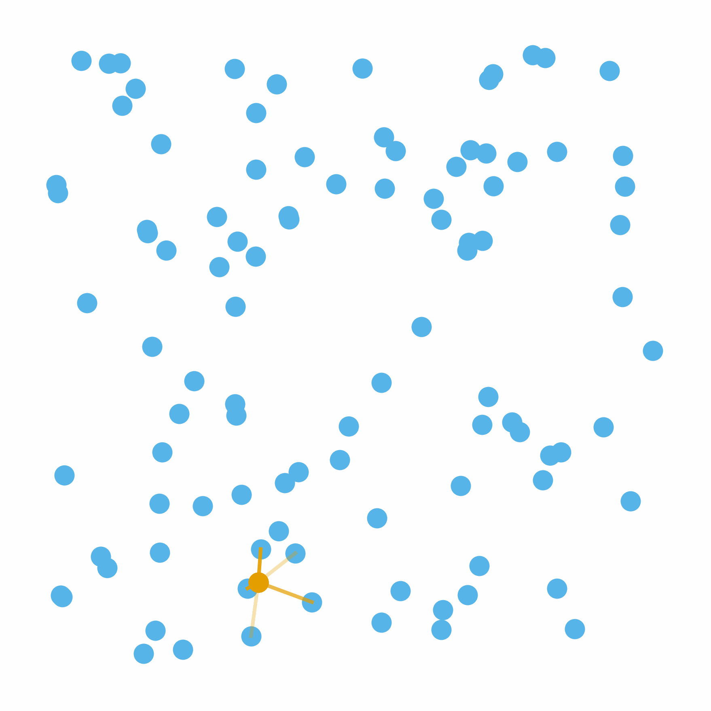
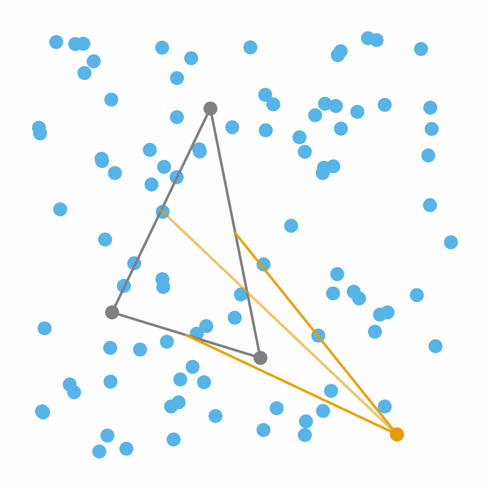
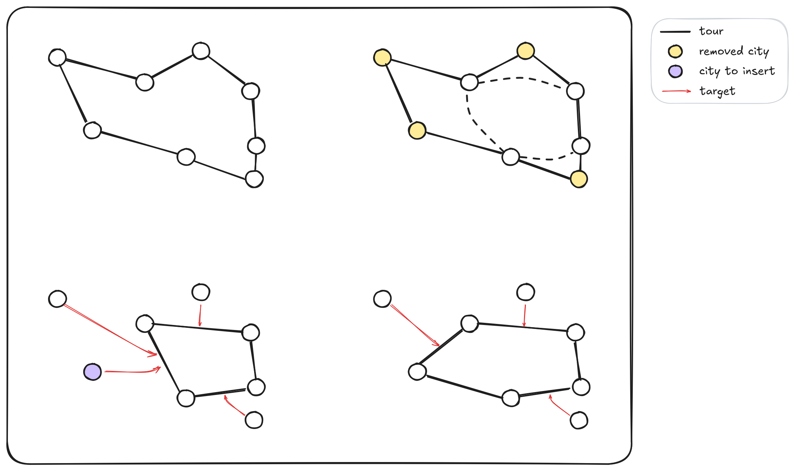
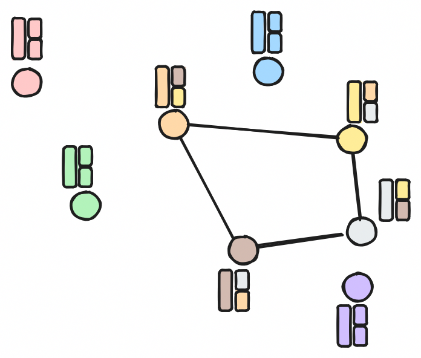
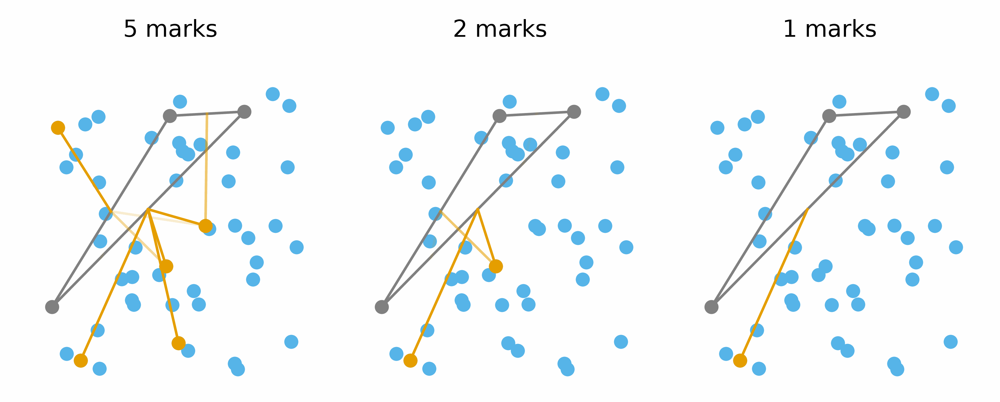
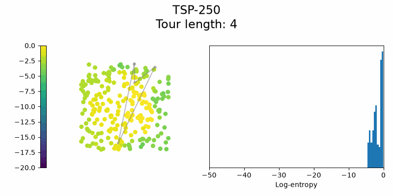
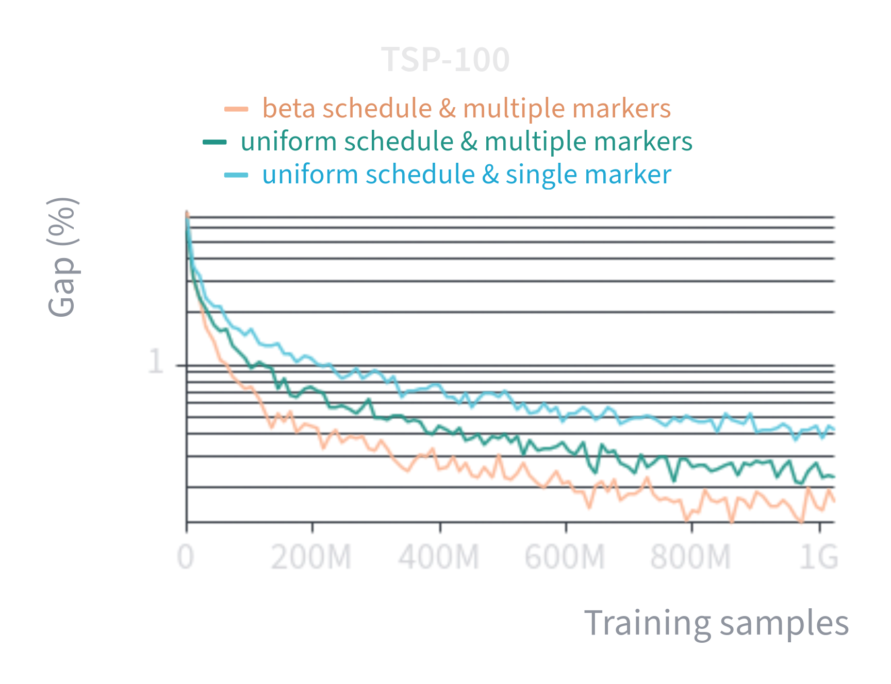
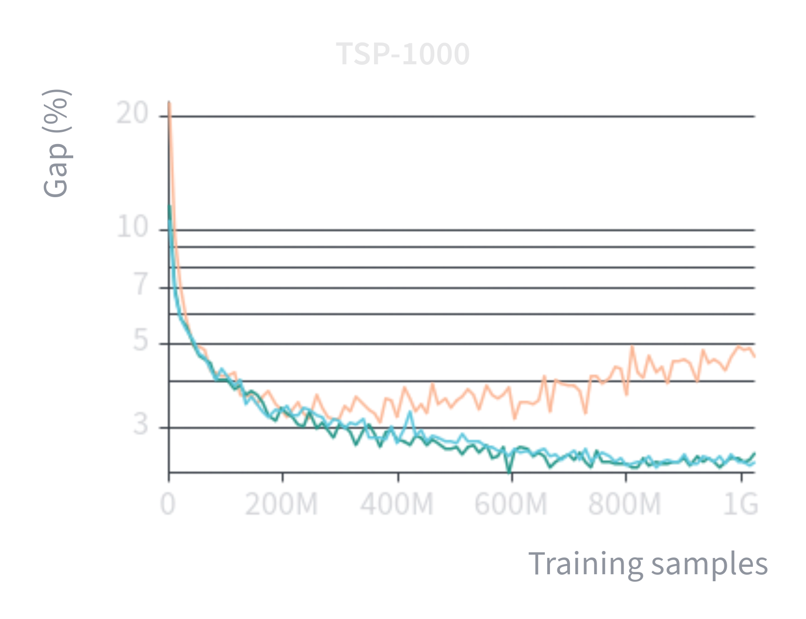

In this post I want to explore the idea of neural insertion solvers for TSP. We can motivate this
work by the idea that such solvers are more flexible than the classical autoregressive next-visit
prediction. Or we can justify it by [comparing][tsp-utils] how the classical random insertion
heuristic compare to the classical nearest neighbor heuristic. But my original motivation was to
better use the GPU during training by always using a full self-attention over all cities of the
training instances, as I'll discuss later.

As a reminder, the world of *autoregressive constructive neural TSP solvers* is dominated by
next-visit predictions. Starting from an initial city, the model predicts one-by-one the next cities
in the sequence. This constructs the final tour and we make sure at every step that only the
remaining unvisited cities can be selected, such that the sequence is a valid TSP solution. In
comparison, a neural insertion model maintains a tour over all currently visited cities and inserts
unvisited cities in between edges of that tour.

  <figure>
    
    <figcaption>Next-visit prediction</figcaption>
  </figure>

  <figure>
    
    <figcaption>Insertion prediction</figcaption>
  </figure>

So far, only one neural insertion model has been proposed by [@Luo2025]. In their work, they select
the next city to insert as the one being the closest unvisited city from the current tour. This
limits inference flexibility and that's why in this work we instead randomly select the cities to
insert.

Highlights:
- We propose a new neural insertion TSP solver. Compared to its predecessor, it randomly selects the
  cities to insert in the tour.
- We design a dedicated neural architecture that is simple and effective.
- We exploit its flexibility to expose a time-quality trade-off. We can insert multiple cities at
  once to cut the total inference time, at the cost of solution quality.
- We reach new state-of-the-art performances compared to other constructive neural solvers here and
  there.

## The Traveling Salesman Problem

This NP-hard problem is defined by a set of $N$ cities $\{x_i\}_{i = 1}^N$ in the 2D Euclidean
plane. The goal is to find the shortest cycle that visits all cities exactly once. Cities
coordinates are represented by a matrix $X \in \mathbb{R}^{N \times 2}$. Random instances are
generated by sampling cities uniformly in the unit square. Solutions are evaluated using the
optimality gap:

$$
  \text{gap}(\%) = 100 * \frac{\text{cost}_{\text{pred}}}{\text{cost}_{\text{opt}}},
$$

where $\text{cost}_{\text{pred}}$ is the length of the predicted solution and
$\text{cost}_{\text{opt}}$ is the length of the optimal solution.

## Training algorithm

Training is done using supervised learning from a set of 1M random TSP instances solved to
optimality with `Concorde` ([@Applegate2006]).

Starting from the optimal tour, some random nodes are removed such that we keep track to which edge
each of them should be inserted to. The model is asked to retrieve that edge for any of random node
we ask for.

The node to insert is marked (see model architecture) and the loss is computed only for this
specific node. Loss is a cross-entropy over the set of edges in the tour.

## Model architecture

The neural architecture needs four things:
1. Represent the current tour.
2. Knows which city is to be inserted.
3. Let information flow between cities easily (even between those that are not connected).
4. Output a probability over each edges of the tour.

We use the standard transformer architecture where each city $i$ is represented by a token $x_i \in
\mathbb{R}^h$ of some hidden dimension $h$. Information is shared using the self-attention
operation. Before each layer, tokens $\{x_i\}_{i = 1}^N$ are enriched by the current tour: each node
receives the embeddings of its neighbors by concatenation and reduce them back to the original
hidden dimension.

<figure class="image">
  
  <figcaption>Each city in the tour receives the embedding of its neighbors.</figcaption>
</figure>

When a city has no neighbors (it is not in the tour), we consider that it is its own neighbor.

Combined with the self-attention operation, our model efficiently represents the current tour while
letting information flowing freely among tokens (this avoids mixing GNNs and self-attention layers
and makes our model arguably simpler).

To specify which city is to be inserted, we mark such city with a dedicated learned embedding (easy).

Finally, we represent edges by the combination of their nodes embeddings and compute the
probabilities using a dot product between the marked city and the edges.

**Comparision with L2C ([@Luo2025]).**
They use a classical encoder-decoder transformer where the encoder is first applied to process
cities Euclidean positions and the decoder is used to generate the insertion probabilities given the
a tour and a city to be inserted. Their model is very similar and only slightly differs in the
following:
- Tokens in their decoder are both edges (by combining nodes embeddings) and unvisited nodes.
- Each decoding iterations use the same shared representation from the encoder.

In comparison, our tokens represent a node at all time and edges are converted only at the very end
of the model to generate the output probabilities. Secondly, each decoding iterations start from a
blank representation and the Euclidean information is processed on-the-fly depending on the current
state of the tour.

## Experiment 1: Baseline

What would such model do when trained on 1M TSP-100 instances?

| Model      | TSP-100  |        | TSP-250  |        | TSP-500  |        | TSP-1000  |        |
|:-----------|:--------:|:------:|:-------: |:------:|:--------:|:------:|:---------:|:------:|
|            | _Gap_    | _Time_ | _Gap_    | _Time_ | _Gap_    | _Time_ | _Gap_     | _Time_ |
| BQ-NCO     | 0.31     | 0.6m   | 0.67     | 1.5m   | 1.17     | 3.8m   | 2.19      | 13m    |
| LEHD       | 0.49     | 0.4m   | 0.95     | 1.0m   | 1.63     | 2.0m   | 3.06      | 4m     |
| PENS-AR    | **0.28** | 1.9m   | **0.47** | 4.9m   | **0.74** | 9.8m   | **1.17**  | 20m    |
| L2C        | 0.55     | 0.3m   | 1.21     | 0.8m   | 2.29     | 1.8m   | 4.65      | 5m     |
| NRI (ours) | 0.41     | 0.4m   | 0.88     | 0.4m   | 1.51     | 0.8m   | 2.42      | 2m     |

Not bad! We already beat L2C ([@Luo2025]), probably thanks to our more efficient architecture.
BQ-NCO ([@Drakulic2023]), LEHD ([@Luo2023]) and PENS-AR are classical neural autoregressive solvers
that predicts the next city to visit. All models here are used in their greedy fashion without any
particular decoding scheme: they take the most probable next action at every step of the solution
generation.

## Experiment 2: Exploiting random insertion flexibility

Since any random node can be inserted, we can mark multiple nodes at the same time and insert them
in parallel. As long as the predicted insertions do not share the same edges, we can safely insert
those nodes in one go.

So we trained a model with multiple cities to insert at the same time. For each element in the
mini-batch, we sample between 1 and 10 unvisited cities to insert and compute the loss over those
cities. Each of those cities are marked such that the model knows which are to be inserted.

Here's the results when the model gets evaluated with a variable number of insertions in parallel:

| Parallel | TSP-100 |        | TSP-250 |        | TSP-500 |        | TSP-1000 |        |
|:---------|:-------:|:------:|:-------:|:------:|:-------:|:------:|:--------:|:------:|
|          | _Gap_   | _Time_ | _Gap_   | _Time_ | _Gap_   | _Time_ | _Gap_    | _Time_ |
| 1 mark   | 0.30    | 0.4m   | 0.56    | 0.4m   | 1.22    | 0.8m   | 2.53     | 2.0m   |
| 2 marks  | 0.38    | 0.3m   | 0.83    | 0.2m   | 1.54    | 0.5m   | 3.82     | 1.1m   |
| 5 marks  | 0.43    | 0.3m   | 1.08    | 0.2m   | 2.13    | 0.3m   | 6.98     | 0.5m   |

Here, "5 marks" means that during solution generation we always mark 5 random unvisited cities and
insert as many as possible. You can see that performance degrades but the time taken to solve the
instances also drop: **there's a time-quality trade-off!**

This trade-off has two possible explanations:
1. The model has to split its focus over multiple elements at the same time, making its prediction
   less sharp.
2. The model builds incompatible solutions by predicting insertions that do not align with each
   other.

**Splitting focus hypothesis.**
We test this hypothesis by comparing how good solutions are when we mark multiple cities at the same
time against marking them one by one and inserting only after the last city (parallel vs sequential
marks).

|                    | TSP-100 | TSP-250 | TSP-500 | TSP-1000 |
|:-------------------|:-------:|:-------:|:-------:|:--------:|
| 1 mark             | 0.30    | 0.56    | 1.22    | 2.53     |
| 5 marks parallel   | 0.43    | 1.08    | 2.13    | 6.98     |
| 5 marks sequential | 0.48    | 0.83    | 1.45    | 2.64     |

The difference is more pronounced when the instances gets harder, which makes sense as it is where
the model needs more brain juice.

**Incompatible solution hypothesis.**
This is harder to test so I'll only present some complaisant arguments.

First, we can see that even the 5 sequential marks didn't completely recover. If compute focus was
the only issue, the model would have predicted similar solutions as the model inserting a single
city at once.

Second, this explanation is actually easy to show in diffusion language models. You can actually see
that some sentences are a mixed of two different valid sentences (see [@Zhao2026]). Such models predict
multiple token distributions in parallel and sampling the tokens can generate incompatible results.

Yet, I believe this hypothesis to only minimally impact the model. If two cities are geometrically
far from each other, there is a small chance that inserting one greatly impacts the insertion choice
of the second. This might only be more pronounced for small instances.

## Experiment 3: Insertion uncertainty

To better understand the solver, we can compute how uncertain it is for different unvisited cities
and at different steps of the solution generation. To do so, we compute for every unvisited cities
the insertion entropy over the edges of the tour and plot the result.

Striking! The first steps seem much harder for the model! With that in mind, what if we biased the
training around those specific steps? When sampling a training tour, we usually first sample the
number of nodes to remove, typically uniformly between $[1, N - 3]$. Instead, we could sample
more often a higher number of nodes.

  <figure>
    
    <figcaption>Sampling multiple markers and biasing the sampling improve training speed.</figcaption>
  </figure>

  <figure>
    
    <figcaption>But the model diverges at large scale.</figcaption>
  </figure>

The resulting model trains much faster!

## Appendix

**Tour encoding variants.**
We initially played with multiple attention ideas:
- Dedicated MHA layer with attention bias relative to the tour distance (only the visited nodes
would participate).
- Dedicated MHA layer with attention bias relative to the insertion cost (only unvisited nodes would
attend to visited nodes).
- Mixing both attentions at the same time.

Overall it added a lot of complexity for little gain so we dropped the idea and went with our
simpler tour encoding. The most promising results were obtained with three dedicated MHAs: one for
unvisited nodes over insertion edges, one for visited nodes over themselves, and one global MHA
without any bias. But this requires three different attention operations for each layer which was
too heavy.

**Architecture details.**
Coordinates are encoded using 2D RoPE, similar to PENS-R. The marks (insertion, visited and
unvisited) are added at the beginning of every layers, during the tour encoding.

[tsp-utils]: https://tangled.org/pierrot-lc.bsky.social/tsp-utils
