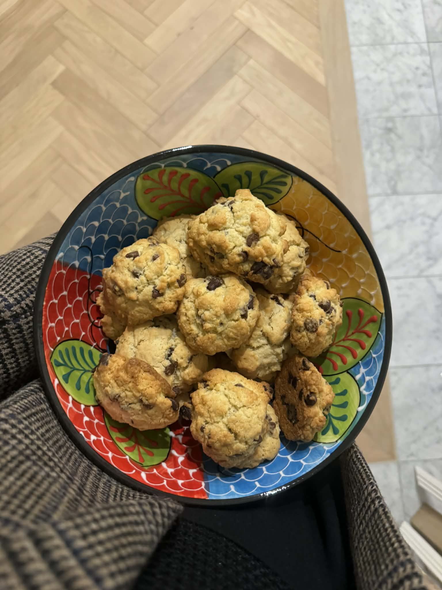

Des cookies à la fois sablés et sablonneux!!

## Ingrédients
Pour **18 portions**:
- 100g beurre mou (possibilité de mélanger 50/50 beurre doux et beurre salé)
- 60g sucre roux
- 10g sucre vanillé
- 1 oeuf
- 160g farine T15
- 2g levure chimique
- 150g chocolat en pépites (noir & lait)

## Instructions
1. Préchauffer le four à 180.
2. Mélanger le beurre mour avec les sucres jusqu'à ce que la préparation soit bien homogène, puis
   incorporer l'oeuf.
3. Mélanger la farine et la levure chimique. Incorporer progressivement à la préparation précédente
   tout en mélangeant.
4. Ajouter les pépites de chocolat. Mélanger à l'aide d'une spatule pour bien répartir les pépites.
5. Façonner de ptites boules de taille équivalente. Les disposer sur une plaque de cuisson
   recouverte de papier sulfurisé ou d'une toie type Silpat.
6. Enfourner à 180°C et cuire environ 10 minutes.
7. Laisser refroidir afin que les cookies deviennent bien croustillants.

