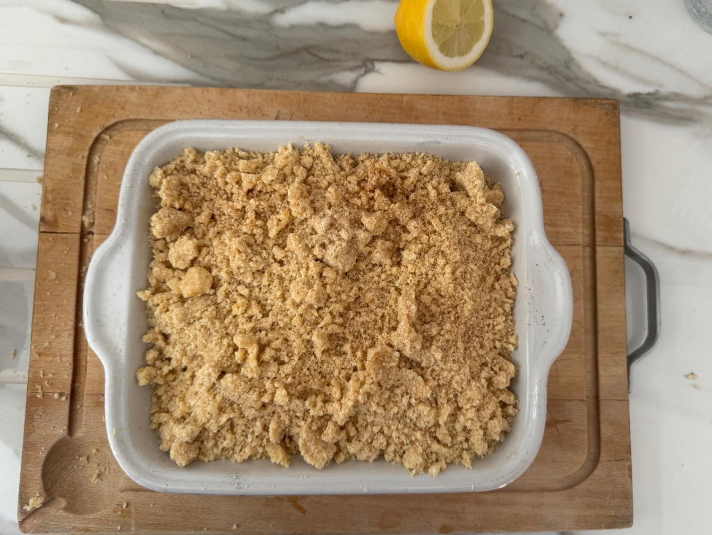

Crumble du chat qui tousse !

## Ingrédients
Pour 4 personnes:
- 4 pommes
- 1/2 citron
- 1/2 sachet de sucre vanillé
- 150g de farine
- 150g de sucre cassonnade
- 125g de beurre mou
- Un peu de cannelle

## Instructions
1. Allumer le four à 210°C
2. Pêler et évider les pommes, pui les couper en petits cubes.
3. Répartir les pommes au fond du plat.
4. Verser le jus de citron et le sucre vanillé sur les pommes. Saupoudrer avec la canelle.
5. Dans un saladier, mélanger la farine et le sucre cassonnade, puis ajouter le beurre mou afin
   d'obtenir une pâte grumeleuse. Répartir le mélange sur les pommes.
6. Enfourner au four pour une durée de 30 minutes.

