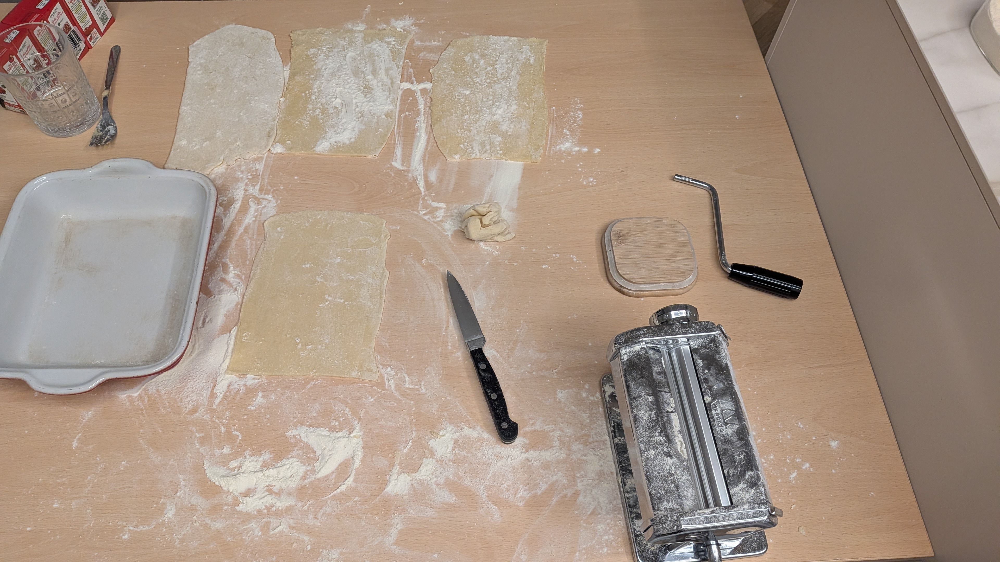
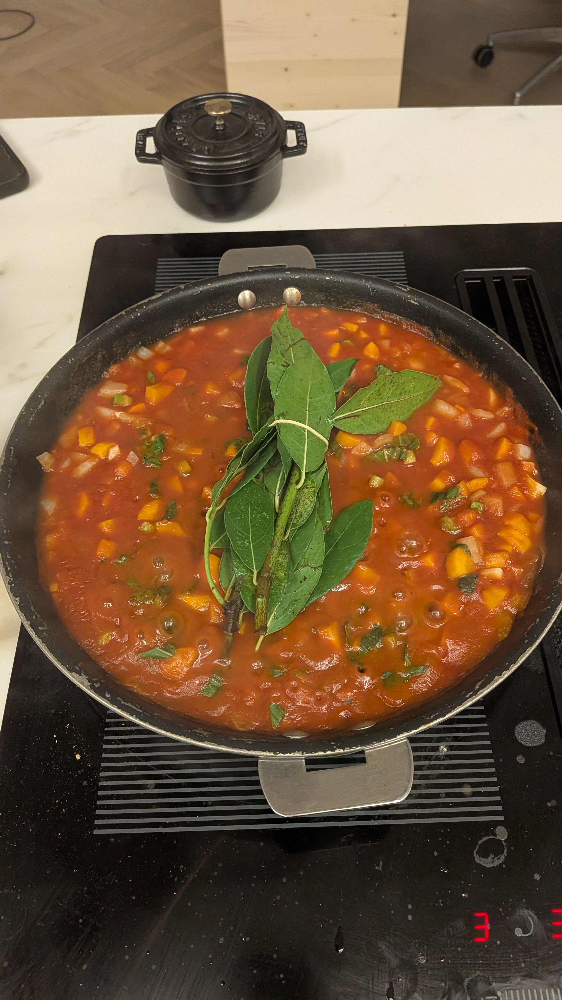
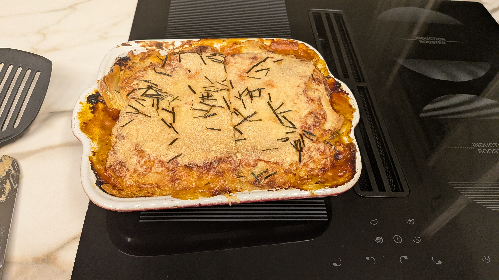

## Pâtes fraîches

Ingrédients :
- 4 oeufs
- 400g de farine
- un tout petit peu d'eau

Étapes :
1. Mélanger les oeufs et la farine.
2. Ajouter petit à petit l'eau (goutte à goutte) jusqu'à ce que la consistance soit acceptable.
3. Bien rouler le morceau de pâte dans la farine avant de l'utiliser dans la machine à pâtes.
4. L'aplatir à une finesse de 5 sur la machine.

## Béchamel

Ingrédients :
- 50g de beurre
- 50g de farine
- 33cl de lait
- noix de muscade

Étapes :
1. Faire fondre le beurre dans une casserole.
2. Ajouter petit à petit la farine jusqu'à ce que ça forme une pâte.
3. Ajouter petit à petit le lait.
4. Finir avec de la noix de muscade, du sel et du poivre.

## Garniture

Ingrédients :
- 1 ou 2 carottes
- 1 tige de céleri
- 600g de purée de tomates
- 1 barquette de champignons (optionnelle)
- 200g de viande hachée (boeuf et porc possibles)
- 1 oignon
- 1/2 gousse d'ail
- du basilic
- 1 bouquet garni
- Fromages en tout genre : fromage râpé, comté, parmesan, mozzarella

Étapes :
1. Couper les carottes, l'ail, l'oignon, le céleri et les champignons.
2. Cuire l'ail et l'oignon à la poêle puis ajouter la purée de tomates et faire mijoter 20 minutes.
3. Rendre les carottes fondantes dans une casserole remplie d'eau, puis les ajouter à la poêle.
4. Faire cuire dans une autre poêle la viande et les champignons.
5. Ajouter le bouquet garni et le basilic dans la poêle avec la purée de tomates, laisser mijoter 10 minutes.

## Lasagnes

1. Beurrer le fond du plat et préparer les lasagnes : pâte -> béchamel -> garniture -> fromages!!
2. Ne pas mettre de mozzarella sur la couche du dessus.
3. Cuire à 200 degrés au four pendant 20 minutes environ.

