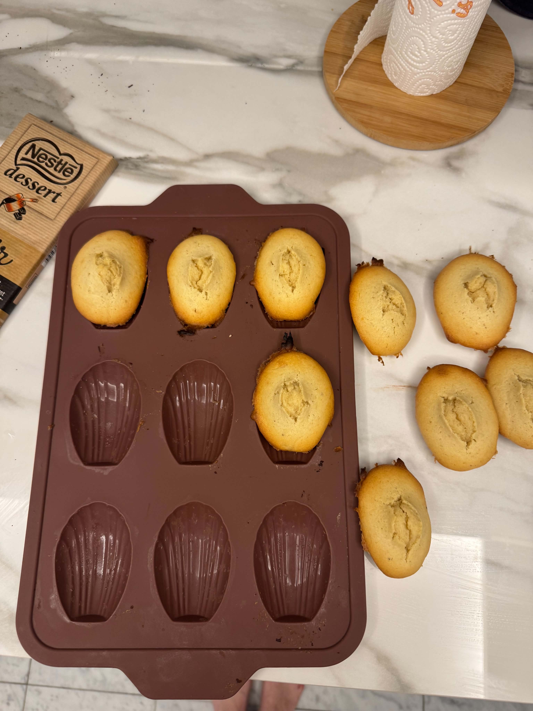
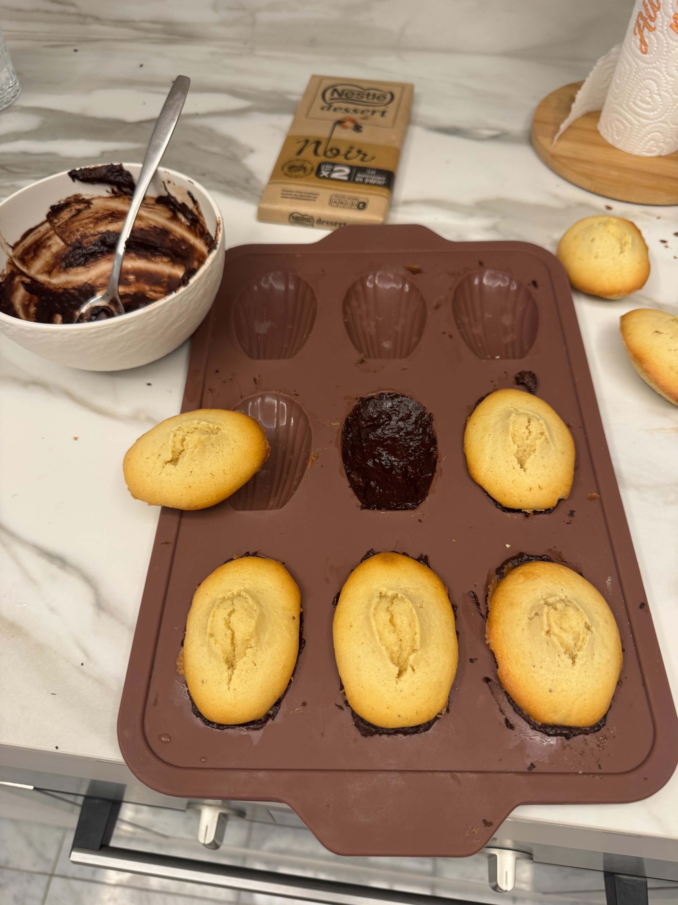

## Ingrédients
Pour 9 madeleines:

- 130g de beurre doux
- 2 gros oeufs
- 70g de sucre cassonade
- 1 cc extrait naturel de vanille
- 130g de farine
- 1 cc levure chimique
- 170g de chocolat noir pâtissier

## Instructions

1. Préparer le beurre noisette : dans une casserole, chauffer à feu doux le beurre en dés, jusqu'à
   obtenir une belle couleur doérée. Laisser refroidir pour la suite.
2. Dans un récipient, fouetter les oeufs et le sucre cassonade. Ajouter l'extrait de vanille.
3. À part, tamiser la farine et la levure. Incorporer ensuite au mélange précédent à l'aide d'un
   fouet. Terminer en incorporant le beurre noisette. La pâte est épaisse c'est normal.
4. Filmer la pâte à madeleine au contact (le film doit toucher la pâte) et réfrigérer 1 heure.
5. Avec une cuillère à soupe, remplir presque jusqu'en haut les cavités d'un moule à madeleine en
   silicone (pas beurré). Réfrigérer à nouveau 1 heure, cela assure une belle bosse.
6. Préchauffer le four à 220°C chaleur traditionnelle. Enfourner la plaque silicone à cette
   température pendant 6 minutes (la poser directement sur la grille, pas sur une plaque). Baisser
   ensuite à 180° et poursuivre la cuisson pendant 5 minutes.
7. Hors du four, laisser tiédir dans le moule puis démouler les madeleines.
8. Faire fondre le chocolat noir au micro-ondes ou bain-marie (il faut que le chocolat soit liquide,
   ajouter un peu d'eau si besoin) puis garnir chaque enpreinte de 2cc de chocolat fondu. Appuyer
   chaque madeleine dans son empreinte pour que le chocolat enrobe bien leur base. Réfrigérer 1
   heure pour que le chocolat durcisse puis démouler les madeleines.

  <figure>
    
  </figure>

  <figure>
    
  </figure>

