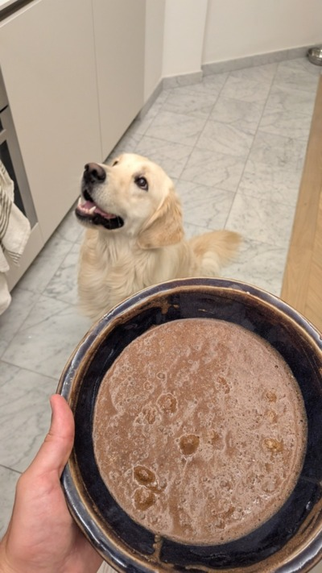
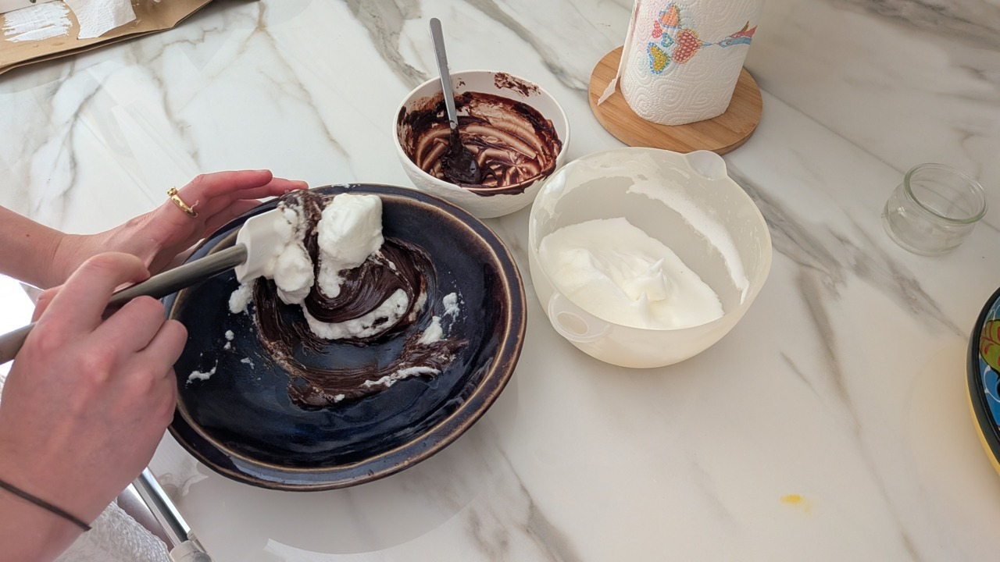

Plagiat de notre mousse préférée !

## Ingrédients

- 100g de chocolat noir pâtissier Nestlé
- 3 oeufs (bio?)
- Petites pépites de chocolat noir

## Instructions

1. Faites fondre le chocolat (micro-ondes ou bain-marie), il faut qu'il soit liquide. Ne pas hésiter
   à rajouter un peu d'eau.
2. Ajoutez les jaunes d'oeufs au chocolat fondu. Mélangez.
3. Battez les blancs en neige avec un peu de sel. Très fort, mais pas trop avant que ça ne
   redevienne liquide. Idéalement, les blancs sont froids.
4. Incorporez énergiquement au chocolat 1/3 des blancs. Ajoutez le reste délicatement à l'aide d'une
   *marise*.
5. Laissez reposer la mousse 3h au réfrigirateur.

