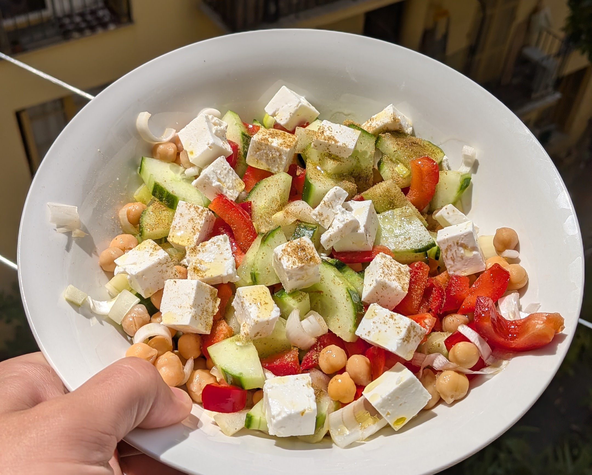

## Ingrédients
Pour deux personnes :
- 250g de pois chiches
- 1 concombre
- 1 poivron
- De la feta
- Du cumin en poudre
- Du thon (_optionnel_)

## Instructions
1. Tout couper en morceaux et mélanger.
2. Ajouter un filet d'une bonne huile d'olive.
3. C'est déjà prêt!

